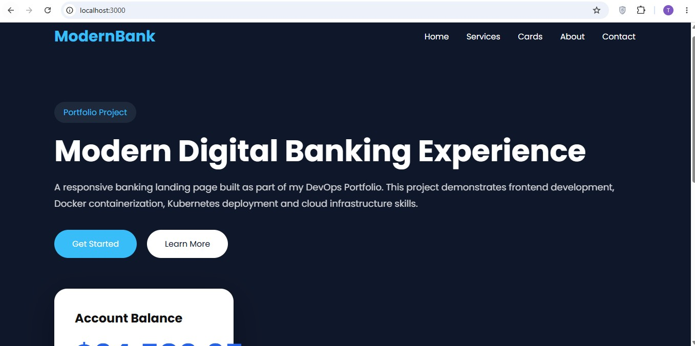
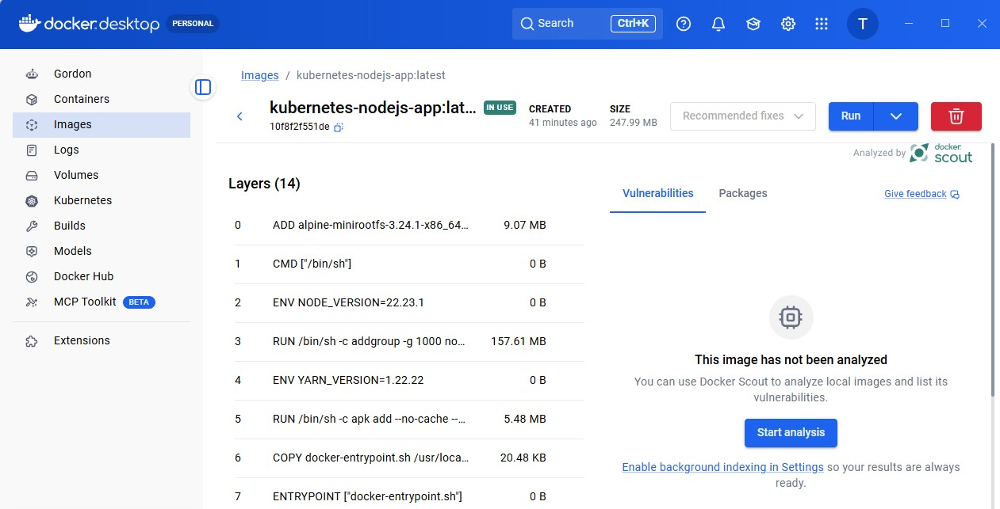
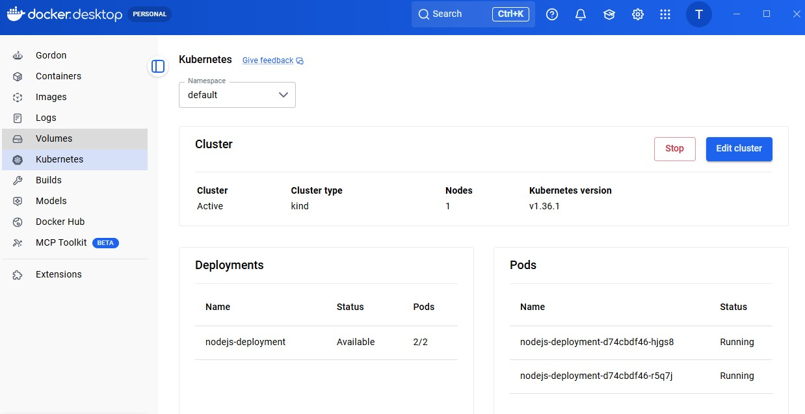

# Kubernetes Node.js Portfolio Application

A modern Node.js web application containerized with Docker and deployed on Kubernetes using Docker Desktop. This project demonstrates containerization, Kubernetes resource management, service exposure, configuration management, and deployment of a production-style application.

---

## Project Overview

This project showcases how to deploy a Node.js application into a Kubernetes cluster using:

- Docker
- Kubernetes
- Docker Desktop Kubernetes
- ConfigMaps
- Deployments
- Services
- Namespaces

The application serves a responsive banking-themed portfolio landing page and demonstrates Kubernetes orchestration concepts.

---

## Technologies Used

- Node.js
- Express.js
- HTML5
- CSS3
- JavaScript
- Docker
- Kubernetes
- Docker Desktop
- kubectl
- Git
- GitHub

---

## Project Structure

```
kubernetes-nodejs-app
│
├── app
│   ├── public
│   │   ├── index.html
│   │   ├── styles.css
│   │   └── script.js
│   │
│   ├── package.json
│   └── server.js
│
├── k8s
│   ├── namespace.yaml
│   ├── deployment.yml
│   ├── service.yml
│   └── configmap.yaml
│
├── screenshots
│
├── Dockerfile
├── .dockerignore
├── .gitignore
└── README.md
```

---

# Features

- Responsive Banking Portfolio Landing Page
- Modern UI
- Loading Screen Animation
- Docker Containerized Application
- Kubernetes Deployment
- Multiple Pod Replicas
- ConfigMap Configuration
- Namespace Isolation
- NodePort Service
- Production-ready Folder Structure

---

# Kubernetes Resources

This project includes the following Kubernetes resources:

| Resource | Purpose |
|-----------|----------|
| Namespace | Isolates project resources |
| Deployment | Manages Pods and Replicas |
| Service | Exposes the application |
| ConfigMap | Stores application configuration |

---

# Docker Build

Build the image

```bash
docker build -t kubernetes-nodejs-app .
```

Run locally

```bash
docker run -d \
--name k8s-node-app \
-p 3000:3000 \
kubernetes-nodejs-app
```

Open

```
http://localhost:3000
```

---

# Kubernetes Deployment

Create namespace

```bash
kubectl apply -f k8s/namespace.yaml
```

Deploy resources

```bash
kubectl apply -f k8s/
```

Verify resources

```bash
kubectl get all -n nodejs
```

---

## Example Output

Pods

```bash
kubectl get pods -n nodejs
```

Example

```
NAME                                  READY   STATUS
nodejs-deployment-xxxxx               1/1     Running
nodejs-deployment-yyyyy               1/1     Running
```

Services

```bash
kubectl get svc -n nodejs
```

Example

```
NAME             TYPE       PORT(S)

nodejs-service   NodePort   3000:30081/TCP
```

---

# Accessing the Application

After deployment

```
http://localhost:30081
```

or

```bash
kubectl port-forward service/nodejs-service 3000:3000 -n nodejs
```

Then open

```
http://localhost:3000
```

---

# Screenshots

## Application

> Add screenshots inside the **screenshots/** folder.

Example

```
screenshots/

home-page.png

kubernetes-pods.png

docker-container.png

docker-images.png
```

Then display them:

```markdown
## Home Page
<p align="center">

</p>


## Docker Container
<p align="center">

</p>


## Kubernetes Pods
<p align="center">

</p>

```

---

# Useful Commands

Build Docker image

```bash
docker build -t kubernetes-nodejs-app .
```

Run Docker container

```bash
docker run -d -p 3000:3000 kubernetes-nodejs-app
```

Check containers

```bash
docker ps
```

View logs

```bash
docker logs <container-id>
```

Apply Kubernetes manifests

```bash
kubectl apply -f k8s/
```

View Pods

```bash
kubectl get pods -n nodejs
```

Describe Deployment

```bash
kubectl describe deployment nodejs-deployment -n nodejs
```

Delete resources

```bash
kubectl delete -f k8s/
```

---

# Skills Demonstrated

- Docker Containerization
- Kubernetes Deployments
- Kubernetes Services
- ConfigMaps
- Namespaces
- NodePort Networking
- Container Lifecycle Management
- Express.js Development
- Linux Containers
- YAML Configuration
- Git Version Control
- Infrastructure as Code

---

# Future Improvements

- Horizontal Pod Autoscaler
- Ingress Controller
- TLS/HTTPS
- Helm Charts
- CI/CD with GitHub Actions
- Docker Hub Image Publishing
- AWS EKS Deployment
- Monitoring with Prometheus & Grafana

---

# Author

**Tevin Omondi**

GitHub

https://github.com/tevinomondifreelance-design

LinkedIn

https://linkedin.com/in/tevin-omondi

---

## License

This project is intended for educational and portfolio purposes.
